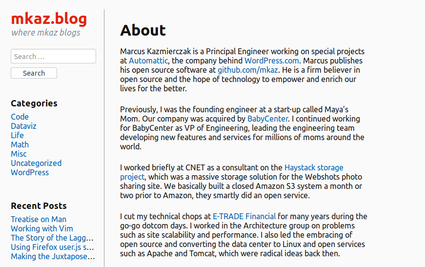

## Theme Preview

See it in action at: https://mkaz.blog/

## Usage

Blog carefully my friends.

You may also be interested in cousin plugins that enhance the experience:

* Tufte-like Sidenotes: https://github.com/mkaz/proximo-sidenote
* Barely Fancy Tips: https://github.com/mkaz/proximo-tips

##  Build

The stylesheets are Sassy. Check out Makefile, they can be built using something like:

	node-sass --output-style compact -o ./ ./assets/style.scss

## Contribute

Yes, please. Issues, code, whatever you've got.

https://github.com/mkaz/proximo

## Credits

Theme initially generated from https://components.underscores.me/ by forking this repo https://github.com/Automattic/theme-components

Uses [Bitsream Charter font](https://en.wikipedia.org/wiki/Bitstream_Charter) which was relased under [this open license](http://mirror.hmc.edu/ctan/fonts/charter/readme.charter).

## License

GPL all the way down.

Proximo WordPress Theme, Copyright 2018 Marcus Kazmierczak
Proximo is distributed under the terms of the GNU GPL

This program is free software: you can redistribute it and/or modify it under the terms of the GNU General Public License as published by the Free Software Foundation, either version 3 of the License, or (at your option) any later version.

This program is distributed in the hope that it will be useful, but WITHOUT ANY WARRANTY; without even the implied warranty of MERCHANTABILITY or FITNESS FOR A PARTICULAR PURPOSE.  See the GNU General Public License for more details.

Proximo WordPress Theme is derived from Underscores WordPress Theme, Copyright 2013 Automattic, Inc.  Underscores WordPress Theme is distributed under the terms of the GNU GPL

